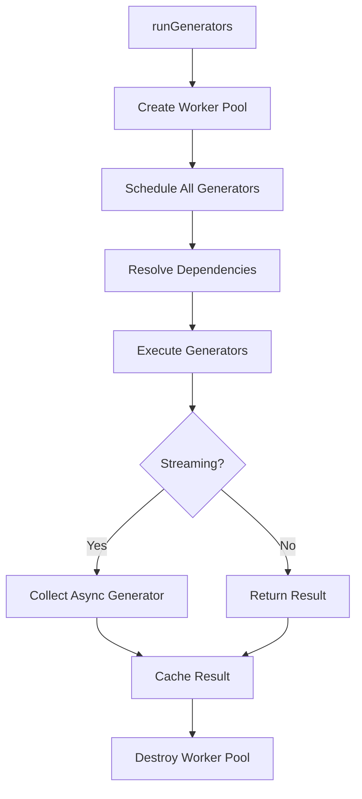

## System Architecture

doc-kit uses a **dependency-driven generator orchestration system** that manages the execution of documentation generators in the correct order, with support for parallel processing and streaming results.

### Core Components

The architecture consists of three main layers:

1. **Generator Orchestration** (`src/generators.mjs`) - Manages dependency chains and execution order
2. **Worker Thread Pool** (`src/threading/`) - Distributes work across CPU cores
3. **Streaming System** (`src/streaming.mjs`) - Handles async generators and result collection

## Dependency Chain

Generators can depend on the output of other generators using the `dependsOn` property:

```javascript
// Example from src/generators/index.mjs
const allGenerators = {
  'legacy-json': {
    dependsOn: undefined, // Root generator
    generate: async (input) => { /* ... */ },
  },
  'json-simple': {
    dependsOn: 'legacy-json', // Depends on legacy-json output
    generate: async (legacyJsonData) => { /* ... */ },
  },
};
```

### Execution Order

The system automatically resolves dependencies and executes generators in the correct order:

1. **Scheduling Phase** - Recursively schedule generators and their dependencies
2. **Execution Phase** - Execute generators once dependencies are resolved
3. **Collection Phase** - Collect results from streaming generators

```javascript
// From src/generators.mjs:51-62
const scheduleGenerator = async (generatorName, configuration) => {
  if (generatorName in cachedGenerators) {
    return; // Already scheduled
  }

  const { dependsOn, generate, hasParallelProcessor } =
    allGenerators[generatorName];

  // Schedule dependency first
  if (dependsOn && !(dependsOn in cachedGenerators)) {
    await scheduleGenerator(dependsOn, configuration);
  }

  // Then schedule this generator
  cachedGenerators[generatorName] = (async () => {
    const dependencyInput = await getDependencyInput(dependsOn);
    return await generate(dependencyInput);
  })();
};
```

## Generator Cache

The orchestration system maintains a cache of generator promises to:

- **Prevent duplicate execution** - Each generator runs only once per pipeline
- **Enable parallel collection** - Multiple consumers can await the same generator
- **Support streaming** - Async generators are collected once and shared

```javascript
// From src/generators.mjs:18
const cachedGenerators = {};

// Generators are stored as promises
cachedGenerators['legacy-json'] = Promise<JSONData>;
cachedGenerators['json-simple'] = AsyncGenerator<SimpleJSON[]>;
```

## Streaming vs Non-Streaming

### Non-Streaming Generators

Return a promise that resolves to the complete result:

```javascript
{
  generate: async (input) => {
    const result = await processAllData(input);
    return result; // Complete result
  }
}
```

### Streaming Generators

Return an async generator that yields chunks of results:

```javascript
{
  hasParallelProcessor: true, // Enables streaming
  generate: async function* (input, worker) {
    // Process in parallel, yield chunks as they complete
    for await (const chunk of worker.stream(items, input, extra)) {
      yield chunk;
    }
  }
}
```

<Warning>
  Streaming generators require `hasParallelProcessor: true` to receive a worker instance.
</Warning>

## Parallel Processing

Generators with `hasParallelProcessor: true` receive a parallel worker instance:

```javascript
// From src/generators.mjs:76-78
const worker = hasParallelProcessor
  ? createParallelWorker(generatorName, pool, configuration)
  : Promise.resolve(null);

const result = await generate(dependencyInput, await worker);
```

The worker distributes items across the thread pool and streams results back as chunks complete.

## Complete Pipeline Flow



### Step-by-Step Execution

1. **Initialize** - Create worker pool with specified thread count
2. **Schedule** - Recursively schedule all requested generators and dependencies
3. **Execute** - Start generator execution (dependencies first)
4. **Stream** - For parallel generators, distribute work across threads
5. **Collect** - Gather all results, collecting streaming generators
6. **Cleanup** - Destroy worker pool and return results

## Configuration Flow

Configuration is passed through the entire pipeline:

```javascript
// From src/generators.mjs:98-104
const runGenerators = async configuration => {
  const { target: generators, threads } = configuration;

  // Create worker pool with thread count
  pool = createWorkerPool(threads);

  // Pass configuration to all generators
  for (const name of generators) {
    await scheduleGenerator(name, configuration);
  }
};
```

Each generator receives:
- **Global settings** - `threads`, `chunkSize`, `input`, `output`
- **Generator-specific config** - From `configuration[generatorName]`

## Performance Characteristics

### Memory Efficiency

- **Streaming generators** - Process and yield chunks incrementally
- **Worker isolation** - Each thread has its own memory space
- **Shared cache** - Results are cached to avoid recomputation

### CPU Utilization

- **Parallel processing** - Work distributed across available CPU cores
- **Async execution** - Non-blocking I/O operations
- **Lazy collection** - Streaming generators only collected when needed

### Optimal Configuration

```javascript
{
  threads: os.cpus().length, // Use all available cores
  chunkSize: 100,            // Balance overhead vs parallelism
  target: ['json-simple']    // Only run needed generators
}
```

## Error Handling

The system handles errors at multiple levels:

1. **Generator errors** - Caught and logged by orchestration system
2. **Worker errors** - Piscina handles thread crashes and restarts
3. **Dependency errors** - Propagate to dependent generators

## Next Steps

<CardGroup cols={2}>
  <Card title="Worker Threads" icon="microchip" href="/advanced/worker-threads">
    Deep dive into the worker thread implementation
  </Card>
  <Card title="Streaming" icon="water" href="/advanced/streaming">
    Learn about async generators and streaming architecture
  </Card>
</CardGroup>