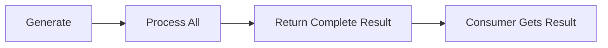
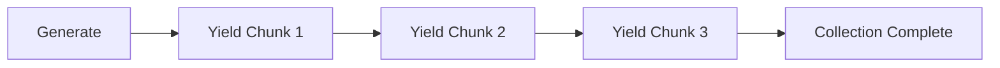

## Streaming Architecture

doc-kit uses **async generators** to stream results from parallel processing. This allows generators to yield chunks of data as they're processed, rather than waiting for all work to complete.

### Why Streaming?

Streaming provides several benefits:

- **Memory efficiency** - Process and yield data incrementally
- **Faster time-to-first-result** - Start consuming results while work continues
- **Better progress feedback** - See chunks complete in real-time
- **Parallel collection** - Multiple consumers can collect the same stream

## Async Generators

An async generator is a function that yields promises:

```javascript
async function* generateNumbers() {
  yield 1;
  yield 2;
  yield 3;
}

// Consume with for-await-of
for await (const num of generateNumbers()) {
  console.log(num); // 1, 2, 3
}
```

### In doc-kit

Generators with parallel processing return async generators:

```javascript
{
  hasParallelProcessor: true,

  async generate(input, worker) {
    // Generator function (returns AsyncGenerator)
    return (async function* () {
      // Stream results from worker
      for await (const chunk of worker.stream(items, input, extra)) {
        yield chunk; // Each chunk contains processed items
      }
    })();
  },
}
```

## Detecting Async Generators

The system checks if a value is an async generator using:

```javascript
// From src/streaming.mjs:13-16
export const isAsyncGenerator = obj =>
  obj !== null &&
  typeof obj === 'object' &&
  typeof obj[Symbol.asyncIterator] === 'function';
```

### Usage

```javascript
const result = await generate(input);

if (isAsyncGenerator(result)) {
  // It's a stream - collect it
  const collected = await collectAsyncGenerator(result);
} else {
  // It's a regular value - use directly
  return result;
}
```

## Collecting Async Generators

Async generators are collected into flat arrays:

```javascript
// From src/streaming.mjs:26-47
export const collectAsyncGenerator = async generator => {
  const results = [];
  let chunkCount = 0;

  for await (const chunk of generator) {
    chunkCount++;
    results.push(...chunk); // Flatten chunks into single array

    streamingLogger.debug(`Collected chunk ${chunkCount}`, {
      itemsInChunk: chunk.length,
    });
  }

  streamingLogger.debug(`Collection complete`, {
    totalItems: results.length,
    chunks: chunkCount,
  });

  return results;
};
```

### Example

```javascript
async function* generateChunks() {
  yield [1, 2, 3];    // Chunk 1
  yield [4, 5];       // Chunk 2
  yield [6, 7, 8, 9]; // Chunk 3
}

const result = await collectAsyncGenerator(generateChunks());
// Result: [1, 2, 3, 4, 5, 6, 7, 8, 9]
```

<Warning>
  Each yielded chunk is **spread** into the results array. Always yield arrays, not individual items.
</Warning>

## Streaming Cache

The streaming cache ensures async generators are only collected once:

```javascript
// From src/streaming.mjs:54-82
export const createStreamingCache = () => {
  const cache = new Map();

  return {
    getOrCollect(key, generator) {
      const hasKey = cache.has(key);

      if (!hasKey) {
        // Start collection and cache the promise
        cache.set(key, collectAsyncGenerator(generator));
      }

      streamingLogger.debug(
        hasKey
          ? `Using cached result for "${key}"`
          : `Starting collection for "${key}"`
      );

      return cache.get(key);
    },
  };
};
```

### Why Cache?

Imagine two generators depend on the same streaming generator:

```javascript
const streamingCache = createStreamingCache();

// First consumer
const result1 = await streamingCache.getOrCollect('json', jsonGenerator);
// Collection starts

// Second consumer (while first is still collecting)
const result2 = await streamingCache.getOrCollect('json', jsonGenerator);
// Returns same promise - no duplicate collection!
```

Without caching, the generator would be collected twice, doubling the work.

## Integration with Generator System

The orchestration system uses the streaming cache automatically:

```javascript
// From src/generators.mjs:18-20
const cachedGenerators = {};
const streamingCache = createStreamingCache();

// When getting dependency input
const getDependencyInput = async dependsOn => {
  if (!dependsOn) return undefined;

  const result = await cachedGenerators[dependsOn];

  // If it's an async generator, collect it (with caching)
  if (isAsyncGenerator(result)) {
    return streamingCache.getOrCollect(dependsOn, result);
  }

  return result;
};
```

## Streaming vs Non-Streaming Flow

### Non-Streaming Generator



```javascript
{
  async generate(input) {
    const result = await processAll(input);
    return result; // Wait for everything
  }
}
```

### Streaming Generator



```javascript
{
  hasParallelProcessor: true,

  async generate(input, worker) {
    return (async function* () {
      for await (const chunk of worker.stream(items, input, extra)) {
        yield chunk; // Stream results as they're ready
      }
    })();
  }
}
```

## Example: Complete Streaming Flow

### 1. Generator Yields Chunks

```javascript
// In your generator
hasParallelProcessor: true,

async generate(input, worker) {
  const items = input.map(extractItems);

  return (async function* () {
    // Worker distributes items across threads
    for await (const chunk of worker.stream(items, input, {})) {
      // chunk = [result1, result2, ...] (100 items)
      yield chunk;
    }
  })();
}
```

### 2. System Detects Async Generator

```javascript
// In src/generators.mjs
const result = await generate(dependencyInput, await worker);

if (!isAsyncGenerator(result)) {
  generatorsLogger.debug(`Completed "${generatorName}"`);
}
// For streaming, completion is logged when collection finishes
```

### 3. Consumer Collects Stream

```javascript
// In src/generators.mjs:115-122
const resultPromises = generators.map(async name => {
  let result = await cachedGenerators[name];

  if (isAsyncGenerator(result)) {
    // Collect the stream (or get cached result)
    result = await streamingCache.getOrCollect(name, result);
  }

  return result;
});
```

### 4. Results Collected and Cached

```javascript
// From collectAsyncGenerator
const results = [];
for await (const chunk of generator) {
  results.push(...chunk); // Flatten chunks
}
return results; // [item1, item2, item3, ...]
```

## Performance Characteristics

### Memory Usage

- **Streaming** - Only holds current chunk in memory
- **Non-streaming** - Holds entire result in memory

```javascript
// Non-streaming: 1GB array in memory
const result = await processAll(millionItems);

// Streaming: 100 items at a time (~100KB chunks)
for await (const chunk of processStreaming(millionItems)) {
  // Previous chunks can be garbage collected
  yield chunk;
}
```

### Time to First Result

- **Streaming** - First chunk available immediately when any thread completes
- **Non-streaming** - Must wait for all processing to finish

### Parallelism

- **Streaming** - Results yielded as soon as any chunk completes (Promise.race)
- **Non-streaming** - Sequential processing or wait for all parallel work

## Best Practices

### DO: Yield Arrays

```javascript
async function* goodGenerator() {
  yield [1, 2, 3]; // ✅ Array
  yield [4, 5];    // ✅ Array
}
```

### DON'T: Yield Individual Items

```javascript
async function* badGenerator() {
  yield 1; // ❌ Not an array
  yield 2; // ❌ Not an array
}
```

### DO: Use Consistent Chunk Sizes

```javascript
// Good - ~100 items per chunk
for (let i = 0; i < items.length; i += 100) {
  yield items.slice(i, i + 100);
}
```

### DON'T: Yield Empty Arrays

```javascript
if (chunk.length > 0) {
  yield chunk; // ✅ Only yield non-empty chunks
}
```

## Debugging Streaming Issues

### Enable Streaming Logs

```bash
DEBUG=doc-kit:streaming npm run generate
```

### Sample Output

```
doc-kit:streaming Starting collection for "json-simple" +0ms
doc-kit:streaming Collected chunk 1 { itemsInChunk: 100 } +50ms
doc-kit:streaming Collected chunk 2 { itemsInChunk: 100 } +45ms
doc-kit:streaming Collected chunk 3 { itemsInChunk: 100 } +48ms
doc-kit:streaming Collection complete { totalItems: 300, chunks: 3 } +2ms
```

## Common Patterns

### Pattern 1: Simple Streaming Generator

```javascript
{
  hasParallelProcessor: true,

  async generate(input, worker) {
    return (async function* () {
      for await (const chunk of worker.stream(input, input, {})) {
        yield chunk;
      }
    })();
  },

  processChunk(items, indices) {
    return indices.map(i => transform(items[i]));
  },
}
```

### Pattern 2: Post-Processing Chunks

```javascript
async generate(input, worker) {
  return (async function* () {
    for await (const chunk of worker.stream(items, input, {})) {
      // Transform chunk before yielding
      const processed = chunk.map(addMetadata);
      yield processed;
    }
  })();
}
```

### Pattern 3: Filtering Chunks

```javascript
async generate(input, worker) {
  return (async function* () {
    for await (const chunk of worker.stream(items, input, {})) {
      // Filter chunk before yielding
      const filtered = chunk.filter(isValid);
      if (filtered.length > 0) {
        yield filtered;
      }
    }
  })();
}
```

## Next Steps

<CardGroup cols={2}>
  <Card title="Worker Threads" icon="microchip" href="/advanced/worker-threads">
    Understand the parallel processing implementation
  </Card>
  <Card title="Architecture" icon="sitemap" href="/advanced/architecture">
    See how streaming fits into the overall system
  </Card>
</CardGroup>