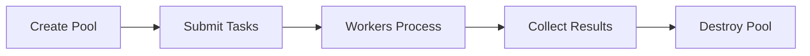

## Worker Thread Architecture

doc-kit uses [Piscina](https://github.com/piscinajs/piscina) to manage a pool of worker threads for parallel processing. This enables efficient CPU-bound operations by distributing work across multiple cores.

### Why Worker Threads?

Documentation generation involves:
- **CPU-intensive transformations** - Parsing, rendering, formatting
- **I/O operations** - Reading source files, writing output
- **Large datasets** - Thousands of API endpoints or documentation pages

Worker threads allow these operations to run in parallel without blocking the main thread.

## Thread Pool Creation

The worker pool is created when the generator pipeline starts:

```javascript
// From src/threading/index.mjs
import Piscina from 'piscina';
import logger from '../logger/index.mjs';

const workerScript = import.meta.resolve('./chunk-worker.mjs');

export default function createWorkerPool(threads) {
  return new Piscina({
    filename: workerScript,        // Worker entry point
    minThreads: threads,           // Keep all threads alive
    maxThreads: threads,           // Fixed pool size
    idleTimeout: Infinity,         // Never destroy idle workers
  });
}
```

### Pool Configuration

- **Fixed size** - `minThreads === maxThreads` for predictable performance
- **Persistent workers** - `idleTimeout: Infinity` keeps threads alive
- **Shared worker script** - All threads execute `chunk-worker.mjs`

## Worker Entry Point

The worker script (`chunk-worker.mjs`) is the entry point for all thread tasks:

```javascript
// From src/threading/chunk-worker.mjs
import { allGenerators } from '../generators/index.mjs';
import { setConfig } from '../utils/configuration/index.mjs';

export default async ({
  generatorName,
  input,
  itemIndices,
  extra,
  configuration,
}) => {
  // Apply configuration in this thread
  await setConfig(configuration);

  // Get the generator
  const generator = allGenerators[generatorName];

  // Process the chunk
  return generator.processChunk(input, itemIndices, extra);
};
```

### Task Parameters

- **generatorName** - Which generator to run
- **input** - Sliced array of items for this chunk
- **itemIndices** - Index mapping (0-based for sliced array)
- **extra** - Additional context (original input, etc.)
- **configuration** - Generator-specific config

## Parallel Worker

The parallel worker (`parallel.mjs`) coordinates work distribution:

```javascript
// From src/threading/parallel.mjs
export default function createParallelWorker(
  generatorName,
  pool,
  configuration
) {
  const { threads, chunkSize } = configuration;
  const generator = allGenerators[generatorName];

  return {
    async *stream(items, fullInput, extra) {
      if (items.length === 0) return;

      // Split into chunks
      const chunks = createChunks(items.length, chunkSize);

      // Submit all tasks to Piscina
      const pending = new Set(
        chunks.map(indices => {
          const promise = pool
            .run(createTask(fullInput, indices, extra, configuration, generatorName))
            .then(result => ({ promise, result }));
          return promise;
        })
      );

      // Yield results as they complete
      let completed = 0;
      while (pending.size > 0) {
        const { promise, result } = await Promise.race(pending);
        pending.delete(promise);
        completed++;
        yield result;
      }
    },
  };
}
```

### Key Features

1. **Chunking** - Items split into `chunkSize` batches
2. **Promise racing** - Yield results as soon as any chunk completes
3. **Non-blocking** - Async generator allows streaming results

## Chunking Strategy

Items are divided into chunks for balanced workload distribution:

```javascript
// From src/threading/parallel.mjs:15-25
const createChunks = (count, size) => {
  const chunks = [];

  for (let i = 0; i < count; i += size) {
    chunks.push(
      Array.from({ length: Math.min(size, count - i) }, (_, j) => i + j)
    );
  }

  return chunks;
};
```

### Example

```javascript
const items = [1, 2, 3, 4, 5, 6, 7, 8, 9, 10];
const chunks = createChunks(items.length, 3);
// Result: [[0, 1, 2], [3, 4, 5], [6, 7, 8], [9]]
```

## Task Creation

Tasks are optimized to minimize data transfer between threads:

```javascript
// From src/threading/parallel.mjs:37-56
const createTask = (
  fullInput,
  indices,
  extra,
  configuration,
  generatorName
) => {
  return {
    generatorName,
    // Only send items needed for this chunk (reduces serialization)
    input: indices.map(i => fullInput[i]),
    // Remap indices to 0-based for sliced array
    itemIndices: indices.map((_, i) => i),
    extra,
    // Only pass needed configuration
    configuration: {
      [generatorName]: configuration[generatorName],
    },
  };
};
```

<Warning>
  Only the items needed for each chunk are serialized and sent to workers. This reduces memory overhead and serialization time.
</Warning>

## Serialization Constraints

Data passed between threads must be **structured cloneable**:

### Allowed Types

- Primitives (string, number, boolean, null, undefined)
- Objects and arrays (plain objects only)
- Dates, RegExp, Map, Set
- ArrayBuffer, TypedArrays

### Not Allowed

- Functions (including methods)
- Class instances (unless serializable)
- Symbols
- WeakMap, WeakSet

```javascript
// Good - Plain objects and primitives
const task = {
  items: [{ name: 'foo', value: 42 }],
  config: { format: 'json' },
};

// Bad - Contains functions
const task = {
  items: [{ transform: () => {} }], // ❌ Function not serializable
  logger: console,                   // ❌ Object with methods
};
```

<Warning>
  Functions and class methods cannot be passed to workers. Extract logic into the worker script or pass serializable configuration instead.
</Warning>

## Single-Threaded Fallback

For small datasets or when `threads: 1`, work runs in the main thread:

```javascript
// From src/threading/parallel.mjs:97-108
const runInOneGo = threads <= 1 || items.length <= 2;

if (runInOneGo) {
  // Run directly in main thread (no serialization overhead)
  const promise = generator
    .processChunk(fullInput, indices, extra)
    .then(result => ({ promise, result }));
  return promise;
}

// Otherwise submit to worker pool
const promise = pool.run(createTask(...));
```

This avoids serialization overhead for small workloads.

## Thread Pool Lifecycle



### Creation

```javascript
// From src/generators.mjs:107
pool = createWorkerPool(threads);
```

### Destruction

```javascript
// From src/generators.mjs:127
await pool.destroy();
```

<Warning>
  Always call `pool.destroy()` to clean up worker threads. Failing to do so will prevent the process from exiting.
</Warning>

## Performance Tuning

### Optimal Thread Count

```javascript
import { cpus } from 'node:os';

const threads = cpus().length; // Use all available cores
```

### Optimal Chunk Size

- **Too small** - High overhead from thread coordination
- **Too large** - Poor load balancing (some threads idle)
- **Sweet spot** - 50-200 items per chunk for most workloads

```javascript
const chunkSize = Math.ceil(items.length / (threads * 4));
// Each thread processes ~4 chunks for good load balancing
```

## Example: Complete Worker Flow

```javascript
// 1. Create pool with 8 threads
const pool = createWorkerPool(8);

// 2. Create parallel worker
const worker = createParallelWorker('json-simple', pool, {
  threads: 8,
  chunkSize: 100,
});

// 3. Stream results from 1000 items
for await (const chunk of worker.stream(items, fullInput, extra)) {
  // Each chunk contains ~100 processed items
  console.log(`Received ${chunk.length} items`);
}

// 4. Clean up
await pool.destroy();
```

## Debugging Worker Issues

### Enable Debug Logging

```bash
DEBUG=doc-kit:parallel,doc-kit:WorkerPool npm run generate
```

### Common Issues

1. **Serialization errors** - Check that all task data is structured cloneable
2. **Worker crashes** - Check for unhandled exceptions in `processChunk`
3. **Deadlocks** - Ensure workers don't wait on main thread

## Next Steps

<CardGroup cols={2}>
  <Card title="Streaming" icon="water" href="/advanced/streaming">
    Learn how async generators enable streaming results
  </Card>
  <Card title="Architecture" icon="sitemap" href="/advanced/architecture">
    Understand the overall system architecture
  </Card>
</CardGroup>