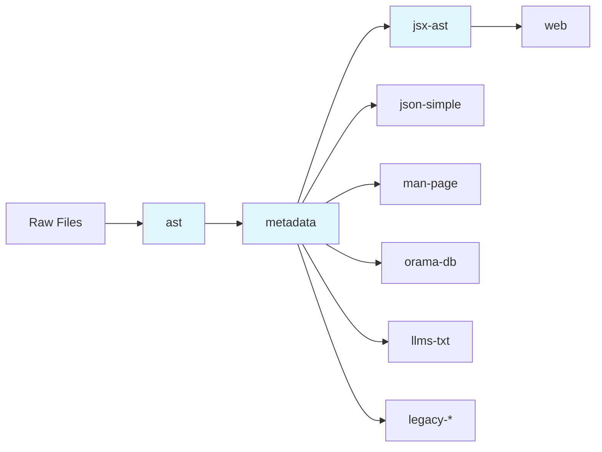

Doc-kit includes a comprehensive set of generators for processing API documentation. Generators are divided into **internal generators** (used only as dependencies) and **public generators** (invokable via CLI).

## Internal Generators

Internal generators process data and provide output for other generators. They cannot be invoked directly via the CLI.

### ast

<ParamField path="ast" type="generator">
  Parses Markdown API doc files into Abstract Syntax Trees (MDAST).
  
  **Depends on**: None (processes raw Markdown files)  
  **Parallel processing**: Yes  
  **Version**: 1.0.0
</ParamField>

This is the first stage in the pipeline. It converts raw Markdown documentation into structured MDAST trees that can be processed by downstream generators.

**Use case**: Foundation for all other generators

### metadata

<ParamField path="metadata" type="generator">
  Generates a flattened list of metadata entries from API documentation.
  
  **Depends on**: `ast`  
  **Parallel processing**: Yes  
  **Version**: 1.0.0
</ParamField>

Extracts structured metadata from the AST, including:
- API entry types (methods, properties, classes, etc.)
- Headings and hierarchy
- Type information
- Stability indicators
- Change history

**Configuration**:
- `typeMap` - Path to type mapping JSON file

**Use case**: Most generators depend on this for structured API data

### jsx-ast

<ParamField path="jsx-ast" type="generator">
  Converts MDAST to JSX Abstract Syntax Trees.
  
  **Depends on**: `metadata`  
  **Parallel processing**: Yes  
  **Version**: 1.0.0
</ParamField>

Transforms metadata and MDAST into JSX AST format, preparing content for web rendering with React components.

**Configuration**:
- `ref` - Git reference for source links (default: 'main')

**Use case**: Required for web output generation

### ast-js

<ParamField path="ast-js" type="generator">
  Parses JavaScript source files into Abstract Syntax Trees.
  
  **Version**: 1.0.0
</ParamField>

Processes JavaScript source code into AST format for analysis and documentation generation.

**Use case**: Processing JavaScript source files alongside Markdown docs

---

## Public Generators

Public generators can be invoked directly via the CLI and produce final output.

### web

<ParamField path="web" type="generator">
  Generates HTML/CSS/JS bundles from JSX AST entries.
  
  **Depends on**: `jsx-ast`  
  **Parallel processing**: No (requires all entries for code splitting)  
  **Version**: 1.0.0
</ParamField>

Produces a complete web bundle including:
- Server-side rendered HTML pages
- Client-side JavaScript with code splitting
- Bundled CSS styles

**Configuration**:
- `templatePath` - Path to HTML template file
- `title` - Site title (default: 'Node.js')
- `imports` - Custom import mappings for components

**Use case**: Building the official Node.js documentation website

**Example**:
```bash
npx @nodejs/doc-kit --generator web --output ./dist
```

### json-simple

<ParamField path="json-simple" type="generator">
  Generates simplified JSON version of API docs.
  
  **Depends on**: `metadata`  
  **Parallel processing**: No  
  **Version**: 1.0.0
</ParamField>

Returns a stringified JSON version of the API documentation. Useful for debugging, testing, or creating custom tooling.

**Use case**: Testing, debugging, or integration with other tools

**Example**:
```bash
npx @nodejs/doc-kit --generator json-simple --output ./api.json
```

### man-page

<ParamField path="man-page" type="generator">
  Generates Unix man pages from CLI documentation.
  
  **Depends on**: `metadata`  
  **Parallel processing**: No  
  **Version**: 1.0.0
</ParamField>

Generates man page formatted documentation (mdoc format) from CLI.md files, following the OpenBSD mdoc.7 specification.

**Configuration**:
- `fileName` - Output filename (default: 'node.1')
- `cliOptionsHeaderSlug` - Slug for CLI options section (default: 'options')
- `envVarsHeaderSlug` - Slug for environment variables section (default: 'environment-variables-1')
- `templatePath` - Path to man page template

**Use case**: Generating the `node.1` man page for Unix systems

**Example**:
```bash
npx @nodejs/doc-kit --generator man-page --output ./man
```

### orama-db

<ParamField path="orama-db" type="generator">
  Generates Orama database for API documentation search.
  
  **Depends on**: `metadata`  
  **Parallel processing**: No  
  **Version**: 1.0.0
</ParamField>

Creates a searchable Orama database from the API documentation, enabling fast client-side search functionality.

**Use case**: Powering the search feature on documentation websites

**Example**:
```bash
npx @nodejs/doc-kit --generator orama-db --output ./search
```

### llms-txt

<ParamField path="llms-txt" type="generator">
  Generates LLM-optimized text format of API documentation.
  
  **Depends on**: `metadata`  
  **Version**: 1.0.0
</ParamField>

Outputs documentation in a format optimized for consumption by Large Language Models.

**Use case**: Providing documentation to AI assistants and LLMs

**Example**:
```bash
npx @nodejs/doc-kit --generator llms-txt --output ./llms.txt
```

### sitemap

<ParamField path="sitemap" type="generator">
  Generates XML sitemap for documentation.
  
  **Version**: 1.0.0
</ParamField>

Creates an XML sitemap for SEO and search engine indexing.

**Use case**: SEO optimization for documentation websites

**Example**:
```bash
npx @nodejs/doc-kit --generator sitemap --output ./sitemap.xml
```

### addon-verify

<ParamField path="addon-verify" type="generator">
  Verifies addon documentation for correctness.
  
  **Version**: 1.0.0
</ParamField>

Validates and verifies addon documentation to ensure it follows the correct format and standards.

**Use case**: Quality assurance for addon documentation

### api-links

<ParamField path="api-links" type="generator">
  Generates database of API links and references.
  
  **Version**: 1.0.0
</ParamField>

Creates a database of all API links and cross-references within the documentation.

**Use case**: Link validation and reference checking

### Legacy Generators

These generators maintain compatibility with older documentation formats:

<AccordionGroup>
  <Accordion title="legacy-html">
    Generates documentation in the legacy HTML format.
    
    **Use case**: Maintaining backward compatibility with older documentation builds
  </Accordion>

  <Accordion title="legacy-html-all">
    Generates all-in-one legacy HTML documentation.
    
    **Use case**: Single-page HTML documentation in legacy format
  </Accordion>

  <Accordion title="legacy-json">
    Generates documentation in the legacy JSON format.
    
    **Use case**: Backward compatibility with tools expecting the old JSON format
  </Accordion>

  <Accordion title="legacy-json-all">
    Generates all-in-one legacy JSON documentation.
    
    **Use case**: Complete API documentation in legacy JSON format
  </Accordion>
</AccordionGroup>

---

## Generator Dependencies

Here's how generators depend on each other:



## Next Steps

<CardGroup cols={2}>
  <Card title="Creating Custom Generators" icon="code" href="/generators/creating-custom">
    Build your own generators
  </Card>
  <Card title="Parallel Processing" icon="bolt" href="/generators/parallel-processing">
    Optimize with worker threads
  </Card>
</CardGroup>