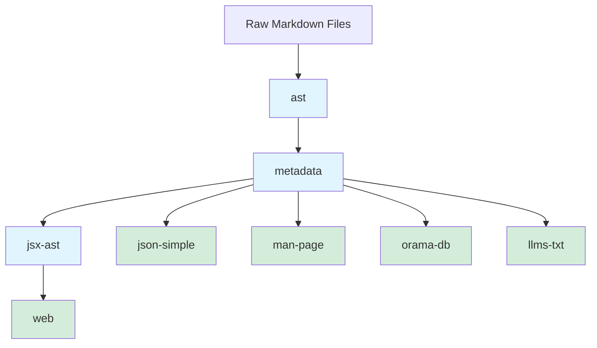

Generators in `@nodejs/doc-kit` transform API documentation through a pipeline. Each generator takes input from a previous generator (or raw files), processes it, and yields output for the next generator or final output.

## Generator Pipeline

The generator system works as a pipeline where each generator depends on the output of a previous generator. Here's the complete pipeline:

<Note>
  **Blue generators** are internal (used as dependencies only). **Green generators** are public (can be invoked via CLI).
</Note>

## Pipeline Stages

The pipeline consists of four main stages:

<Steps>
  <Step title="Parse to AST">
    The `ast` generator parses raw Markdown files into Abstract Syntax Trees (MDAST). This is the first stage that converts unstructured text into a structured format.
    
    **Generator**: `ast`  
    **Depends on**: None (processes raw files)  
    **Parallel processing**: Yes
  </Step>

  <Step title="Extract Metadata">
    The `metadata` generator extracts structured metadata from the AST, creating a flattened list of API documentation entries with type information, headings, and relationships.
    
    **Generator**: `metadata`  
    **Depends on**: `ast`  
    **Parallel processing**: Yes
  </Step>

  <Step title="Convert to JSX AST">
    The `jsx-ast` generator converts the metadata and MDAST into JSX Abstract Syntax Trees, preparing the content for web rendering.
    
    **Generator**: `jsx-ast`  
    **Depends on**: `metadata`  
    **Parallel processing**: Yes
  </Step>

  <Step title="Generate Output">
    Multiple generators can consume the metadata or JSX AST to produce different output formats:
    - `web` - HTML/CSS/JS bundles
    - `json-simple` - Simple JSON format
    - `man-page` - Unix man pages
    - `orama-db` - Search database
    - `llms-txt` - LLM-optimized text
  </Step>
</Steps>

## How Dependencies Work

Each generator declares its dependency using the `dependsOn` field. The framework automatically:

1. **Constructs the pipeline** based on dependencies
2. **Executes generators in order** to satisfy dependencies
3. **Caches output** so each generator runs only once
4. **Enables parallel consumption** when multiple generators depend on the same output

### Multiple Consumers

Multiple generators can depend on the same generator. For example, the `metadata` generator is consumed by:

- `jsx-ast` - For web rendering
- `json-simple` - For JSON output
- `man-page` - For man page generation
- `orama-db` - For search indexing
- `llms-txt` - For LLM consumption

The framework ensures `metadata` runs only once and its output is cached for all consumers.

## Generator Types

### Internal Generators

Internal generators are used only as dependencies and are not exposed via CLI:

- **`ast`** - Parses Markdown to MDAST
- **`metadata`** - Extracts structured metadata
- **`jsx-ast`** - Converts to JSX AST
- **`ast-js`** - Parses JavaScript files

### Public Generators

Public generators can be invoked directly via the CLI:

- **`web`** - Generates HTML/CSS/JS bundles
- **`json-simple`** - Generates simple JSON
- **`man-page`** - Generates Unix man pages
- **`orama-db`** - Generates search database
- **`legacy-html`** - Legacy HTML format
- **`legacy-json`** - Legacy JSON format
- **`addon-verify`** - Verifies addon documentation
- **`api-links`** - Generates API link database
- **`llms-txt`** - Generates LLM-optimized text
- **`sitemap`** - Generates sitemap

See [Built-in Generators](/generators/built-in) for detailed descriptions of each generator.

## Streaming vs. Batch Processing

### Streaming Generators

Streaming generators yield results as they're produced using async generators. This enables:

- **Reduced memory usage** - Process data in chunks
- **Earlier downstream starts** - Next generator can begin before this one finishes
- **Better parallelism** - Multiple generators work simultaneously

Most generators support streaming, especially those with `hasParallelProcessor: true`.

### Batch Generators

Some generators must collect all input before processing. For example, the `web` generator needs all entries together to generate code-split bundles.

Use batch processing when:
- You need all data to make decisions (e.g., code splitting, global analysis)
- Output format requires complete dataset
- Cross-references between items need resolution

## Next Steps

<CardGroup cols={2}>
  <Card title="Built-in Generators" icon="list" href="/generators/built-in">
    Explore all available generators and their purposes
  </Card>
  <Card title="Creating Custom Generators" icon="code" href="/generators/creating-custom">
    Learn how to create your own generators
  </Card>
  <Card title="Parallel Processing" icon="bolt" href="/generators/parallel-processing">
    Implement worker-based parallel processing
  </Card>
</CardGroup>