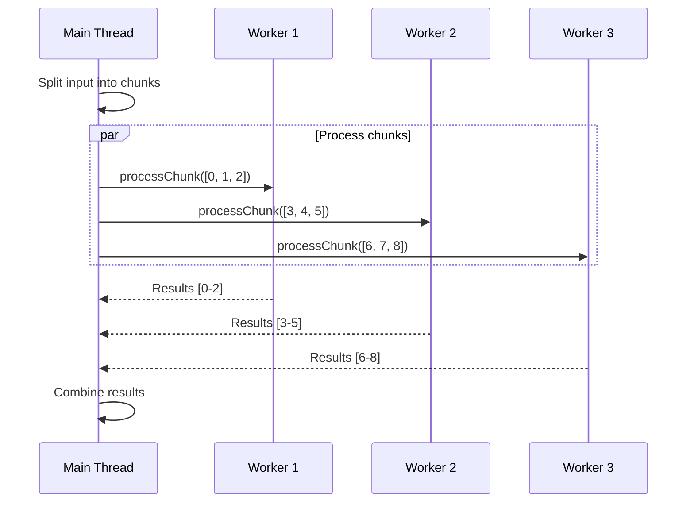

For generators processing large datasets, doc-kit supports parallel processing using worker threads. This guide explains how to implement worker-based processing in your generators.

## When to Use Parallel Processing

<CardGroup cols={2}>
  <Card title="Use Workers When" icon="check" color="#16a34a">
    - Processing many independent items
    - Each item takes significant time
    - Operations are CPU-intensive
    - Dataset is large (hundreds+ of files)
  </Card>
  <Card title="Don't Use Workers When" icon="xmark" color="#dc2626">
    - Items have dependencies on each other
    - Output must be in specific order
    - Operation is I/O bound
    - Dataset is small (< 100 items)
  </Card>
</CardGroup>

## How Parallel Processing Works



The framework:
1. Splits input into chunks based on CPU cores
2. Spawns worker threads (one per core)
3. Each worker processes its assigned items using `processChunk`
4. Main thread collects and streams results via `generate`

## Implementing Parallel Processing

<Steps>
  <Step title="Enable Parallel Processing">
    Set `hasParallelProcessor: true` in generator metadata:

    ```javascript
    // src/generators/parallel-generator/index.mjs
    import { createLazyGenerator } from '../../utils/generators.mjs';

    /**
     * @type {import('./types').Generator}
     */
    export default createLazyGenerator({
      name: 'parallel-generator',

      version: '1.0.0',

      description: 'Processes data in parallel',

      dependsOn: 'metadata',

      // Enable parallel processing
      hasParallelProcessor: true,
    });
    ```
  </Step>

  <Step title="Define Types">
    Create types for `processChunk` in `types.d.ts`:

    ```typescript
    export type Generator = GeneratorMetadata<
      {
        // Custom configuration
        myOption: string;
      },
      Generate<InputType, AsyncGenerator<OutputType>>,
      // processChunk signature
      ProcessChunk<
        InputType[],           // Full input array
        OutputType[],          // Chunk results
        SerializableDeps       // Serializable dependencies
      >
    >;
    ```
  </Step>

  <Step title="Implement processChunk">
    Create the `processChunk` function in `generate.mjs`:

    ```javascript
    // src/generators/parallel-generator/generate.mjs

    /**
     * Process a chunk of items in a worker thread.
     * This function runs in isolated worker threads.
     *
     * @type {import('./types').Generator['processChunk']}
     */
    export async function processChunk(fullInput, itemIndices, deps) {
      const results = [];

      // Process only the items at specified indices
      for (const idx of itemIndices) {
        const item = fullInput[idx];
        const result = await processItem(item, deps);
        results.push(result);
      }

      return results;
    }

    /**
     * Process a single item
     * @param {MetadataEntry} item
     * @param {object} deps
     */
    async function processItem(item, deps) {
      // Your processing logic here
      return {
        name: item.heading.data.name,
        type: item.type,
        // ... transformed data
      };
    }
    ```

    <Warning>
      `processChunk` runs in worker threads with **no access to main thread state**. Only use serializable data.
    </Warning>
  </Step>

  <Step title="Implement generate">
    Implement the `generate` function to orchestrate workers:

    ```javascript
    /**
     * Main generation function that orchestrates worker threads
     *
     * @type {import('./types').Generator['generate']}
     */
    export async function* generate(input, worker) {
      const config = getConfig('parallel-generator');

      // Prepare serializable dependencies
      const deps = {
        version: config.version.toString(),
        myOption: config.myOption,
        // Only include JSON-compatible data
      };

      // Collect input into array for chunking
      const inputArray = [];
      for await (const item of input) {
        inputArray.push(item);
      }

      // Stream chunks as they complete
      for await (const chunkResult of worker.stream(inputArray, inputArray, deps)) {
        // chunkResult is an array of processed items from one chunk
        
        // Yield each item individually
        for (const item of chunkResult) {
          yield item;
        }
        
        // Or yield the whole chunk
        // yield chunkResult;
      }
    }
    ```
  </Step>
</Steps>

## Key Concepts

### Full Input and Item Indices

Workers receive the **full input array** but only process items at specified **indices**:

```javascript
export async function processChunk(fullInput, itemIndices, deps) {
  const results = [];

  // fullInput: [item0, item1, item2, ..., item99]
  // itemIndices: [0, 1, 2] (first chunk) or [3, 4, 5] (second chunk), etc.

  for (const idx of itemIndices) {
    const item = fullInput[idx]; // Access only assigned items
    results.push(await processItem(item, deps));
  }

  return results;
}
```

This allows workers to access other items for context while processing their assigned items.

### Serializable Dependencies

Only **JSON-compatible data** can be passed to workers:

<CodeGroup>
```javascript Good - Serializable
const deps = {
  version: '1.0.0',          // String ✓
  maxSize: 1024,             // Number ✓
  enabled: true,             // Boolean ✓
  config: { key: 'value' },  // Plain object ✓
  list: [1, 2, 3],          // Array ✓
};
```

```javascript Bad - Not Serializable
const deps = {
  callback: () => {},        // Function ✗
  date: new Date(),          // Date object ✗
  regex: /pattern/,          // RegExp ✗
  map: new Map(),            // Map ✗
  buffer: Buffer.from(''),   // Buffer ✗
  instance: new MyClass(),   // Class instance ✗
};
```
</CodeGroup>

**Converting non-serializable data**:
```javascript
import getConfig from '../../utils/configuration/index.mjs';

export async function* generate(input, worker) {
  const config = getConfig('my-generator');

  // Convert SemVer to string
  const deps = {
    version: config.version.toString(),
    
    // Extract only serializable parts
    ref: config.ref,
    
    // Read file contents instead of passing file handles
    template: await readFile(config.templatePath, 'utf-8'),
  };

  // ...
}
```

## Worker Stream API

The `worker.stream()` method manages parallel processing:

```javascript
worker.stream(
  input,        // Items to process (array)
  fullInput,    // Full input passed to processChunk
  deps          // Serializable dependencies
)
```

**Parameters**:
- `input` - Array of items to split into chunks
- `fullInput` - Full input array passed to each `processChunk` (usually same as `input`)
- `deps` - Serializable dependencies passed to `processChunk`

**Returns**: `AsyncGenerator<ChunkResult[]>`

Each iteration yields results from one completed chunk.

### Processing Stream Results

<CodeGroup>
```javascript Yield Individual Items
export async function* generate(input, worker) {
  const inputArray = await collectAll(input);
  const deps = { /* ... */ };

  for await (const chunkResult of worker.stream(inputArray, inputArray, deps)) {
    // chunkResult is an array from one chunk
    for (const item of chunkResult) {
      yield item; // Yield items one by one
    }
  }
}
```

```javascript Yield Chunks
export async function* generate(input, worker) {
  const inputArray = await collectAll(input);
  const deps = { /* ... */ };

  for await (const chunkResult of worker.stream(inputArray, inputArray, deps)) {
    yield chunkResult; // Yield entire chunk at once
  }
}
```

```javascript Collect All Results
export async function generate(input, worker) {
  const inputArray = await collectAll(input);
  const deps = { /* ... */ };

  const allResults = [];
  for await (const chunkResult of worker.stream(inputArray, inputArray, deps)) {
    allResults.push(...chunkResult);
  }

  return allResults; // Return all at once (non-streaming)
}
```
</CodeGroup>

## Complete Example

Here's a complete parallel processing generator:

<CodeGroup>
```javascript index.mjs
// src/generators/jsx-ast/index.mjs
import { createLazyGenerator } from '../../utils/generators.mjs';

/**
 * Generator for converting MDAST to JSX AST.
 *
 * @type {import('./types').Generator}
 */
export default createLazyGenerator({
  name: 'jsx-ast',

  version: '1.0.0',

  description: 'Generates JSX AST from the input MDAST',

  dependsOn: 'metadata',

  defaultConfiguration: {
    ref: 'main',
  },

  hasParallelProcessor: true,
});
```

```typescript types.d.ts
export type Generator = GeneratorMetadata<
  {
    ref: string;
  },
  Generate<
    AsyncIterable<MetadataEntry>,
    AsyncGenerator<JSXEntry>
  >,
  ProcessChunk<
    MetadataEntry[],
    JSXEntry[],
    { ref: string }
  >
>;
```

```javascript generate.mjs
import getConfig from '../../utils/configuration/index.mjs';

/**
 * Process a chunk of metadata entries
 *
 * @type {import('./types').Generator['processChunk']}
 */
export async function processChunk(fullInput, itemIndices, deps) {
  const results = [];

  for (const idx of itemIndices) {
    const entry = fullInput[idx];
    
    // Convert MDAST to JSX AST
    const jsxEntry = {
      ...entry,
      jsx: convertToJSX(entry.content, deps.ref),
    };
    
    results.push(jsxEntry);
  }

  return results;
}

/**
 * Main generation function
 *
 * @type {import('./types').Generator['generate']}
 */
export async function* generate(input, worker) {
  const config = getConfig('jsx-ast');

  // Prepare serializable dependencies
  const deps = {
    ref: config.ref,
  };

  // Collect all input
  const entries = [];
  for await (const entry of input) {
    entries.push(entry);
  }

  // Process in parallel and stream results
  for await (const chunkResult of worker.stream(entries, entries, deps)) {
    for (const jsxEntry of chunkResult) {
      yield jsxEntry;
    }
  }
}

function convertToJSX(mdast, ref) {
  // Conversion logic...
}
```
</CodeGroup>

## Performance Considerations

### Chunk Size

The framework automatically determines chunk size based on:
- Number of CPU cores
- Total number of items
- Minimum chunk size (to avoid overhead)

You don't need to configure this manually.

### Worker Overhead

Worker threads have startup overhead. Parallel processing is beneficial when:
- **Processing time per item** > **Worker overhead per item**
- Generally beneficial for 100+ items with non-trivial processing

### Memory Usage

<Warning>
  Each worker receives a **copy** of `fullInput` and `deps`. For large datasets, this can use significant memory.
</Warning>

**Optimization strategies**:
1. Only pass necessary data in `deps`
2. Consider using `itemIndices` to access shared readonly data
3. For very large datasets, consider streaming instead of collecting all input

## Debugging Worker Issues

### Common Issues

<AccordionGroup>
  <Accordion title="Error: Cannot serialize X">
    **Cause**: Trying to pass non-serializable data in `deps`
    
    **Solution**: Convert to JSON-compatible format:
    ```javascript
    // Bad
    const deps = { version: config.version }; // SemVer object
    
    // Good
    const deps = { version: config.version.toString() };
    ```
  </Accordion>

  <Accordion title="Workers not processing all items">
    **Cause**: Not correctly iterating `itemIndices`
    
    **Solution**: Ensure you process only assigned indices:
    ```javascript
    export async function processChunk(fullInput, itemIndices, deps) {
      const results = [];
      
      // Correct
      for (const idx of itemIndices) {
        results.push(processItem(fullInput[idx]));
      }
      
      return results;
    }
    ```
  </Accordion>

  <Accordion title="Undefined variables in processChunk">
    **Cause**: Accessing main thread state from worker
    
    **Solution**: Pass all needed data through `deps`:
    ```javascript
    // Bad - accessing outer scope
    const VERSION = '1.0.0';
    export async function processChunk(fullInput, itemIndices, deps) {
      console.log(VERSION); // undefined in worker!
    }
    
    // Good - passing through deps
    export async function* generate(input, worker) {
      const deps = { version: '1.0.0' };
      await worker.stream(inputArray, inputArray, deps);
    }
    
    export async function processChunk(fullInput, itemIndices, deps) {
      console.log(deps.version); // Works!
    }
    ```
  </Accordion>
</AccordionGroup>

## Next Steps

<CardGroup cols={2}>
  <Card title="Creating Custom Generators" icon="code" href="/generators/creating-custom">
    Learn the basics of generator creation
  </Card>
  <Card title="Built-in Generators" icon="list" href="/generators/built-in">
    See parallel processing in action
  </Card>
</CardGroup>